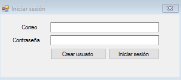
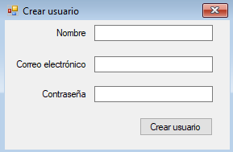
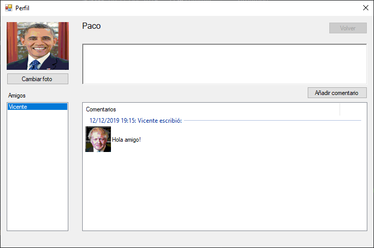

# DIM_Voice
(Developed during the Software Engineer Master) A Windows Form application reproducing basic forms of a social network that can be managed using voice commands.

# Introduction
The voice commands that can be used are the following:

- {Ir | Navegar} a [Nombre de usuario] (por ejemplo, Vicente). The action takes us to the profile of the selected user.
- {Ocultar | Mostrar} foto. The action shows or hides the profile photo.
- {Aumentar | Reducir} {letra | fuente | tamaño de letra | tamaño de fuente}. Increases or decreases the font of the username tag. 
- Volver/Atrás/Retroceder. In case of having opened the profile of another user, go back to the previous one visited.
- {Escribir | Añadir |Dictar comentario}. A dictation sequence begins that ends when the application user says “End dictation”.
- Borrar comentario. Deletes the written text to add a comment.

There is an additional startup project: DictationTest. In this project, tests have been done to emulate voice dictation to a text box. The UI is much simpler. The commands that can be used here are the last two of those described in the application.

# Some user interfaces

